# Getting past the secure gateway.

## Background
Most modern cars has a security gateway (SGW) that filters traffic so that one cannot read canbus traffic or send commands through the OBDII port. To get to the canbus(es) one have to physically connect to the can wiring in the car.
For an introduction to CANBUS technology see 
[this excellent article](https://www.csselectronics.com/pages/can-bus-simple-intro-tutorial).

This writeup is about connecting into the canbus behind the SGW of a fairly modern car, the Hyundai Ioniq 5 model year 2022, without harming any wiring. Beware, this is not for the faint hearted and you can void your warranty by doing this.

## The SGW

The SGW in the Ioniq 5 is named ICU, Integrated Controller Unit (not to be confused with the infamous ICCU that still is the bane of these cars). The ICU is placed under the dash on the driver side right behind the OBDII port and can be dismounted fairly easily after removing a couple of panels.

Get hold of a service manual by searching r/ioniq5 on reddit and look for how to remove "Crash pad lower panel".
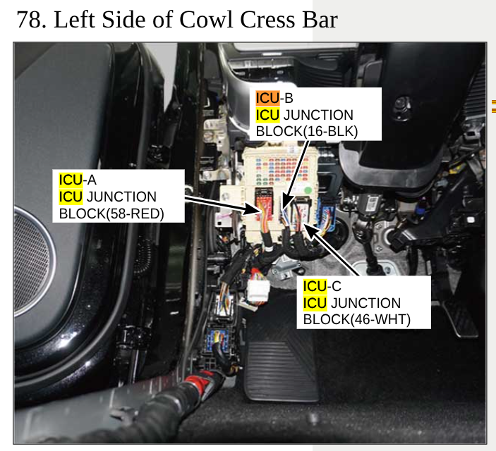

## Wiring layouts
By looking through the wiring harness layouts and schematics in the repair shop manuals one can see that the car has 10 different CAN-buses. Where 8 of them are coming together in one connector on the back of the ICU which acts as a network hub/gateway between them.

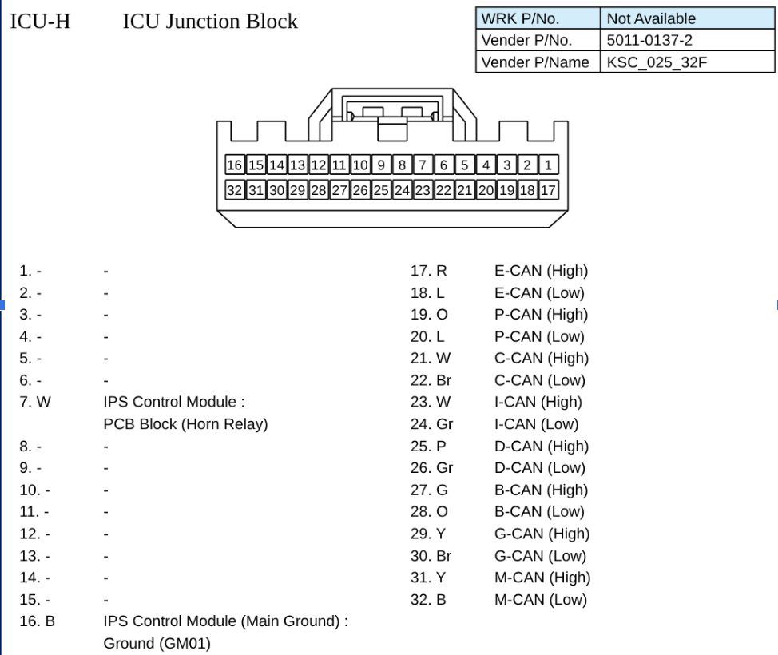

## Getting a harness

It turns out that the connector above is a nearly standard 32-pin connector used in other cars and extension harnesses can be found on aliexpress: https://www.aliexpress.com/item/1005007839039821.html

Many thanks to the friendly folks at r/CarHacking for guiding me in the right direction here, https://www.reddit.com/r/CarHacking/comments/1kdcalf/connector_type/

Remark, one needs to remove some plastic from the harness plugs to fit into the ICU-connectors:

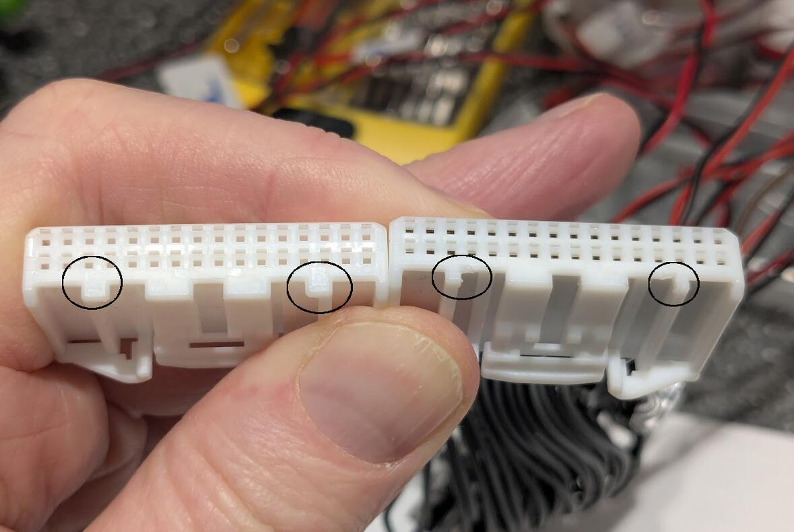
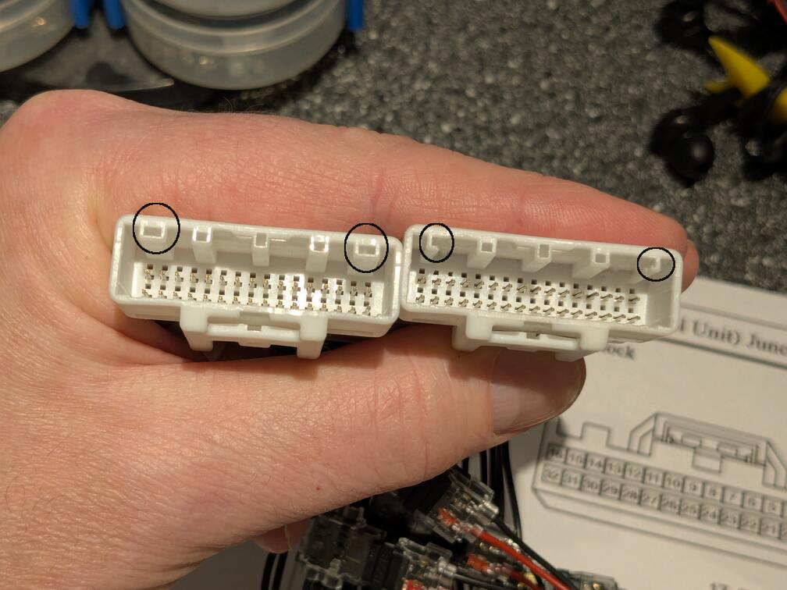
(Unmodified connector on the left.)

Care is recommended as the pins are fragile and bend easily. Buy two or more in case something breaks. Use a fine woodworking tool to cut/scrape away the excess plastic.

## Tapping into the CAN-buses

Patching into the wiring on the harness is straight forward using T-taps.
Original extension harness from aliexpress:
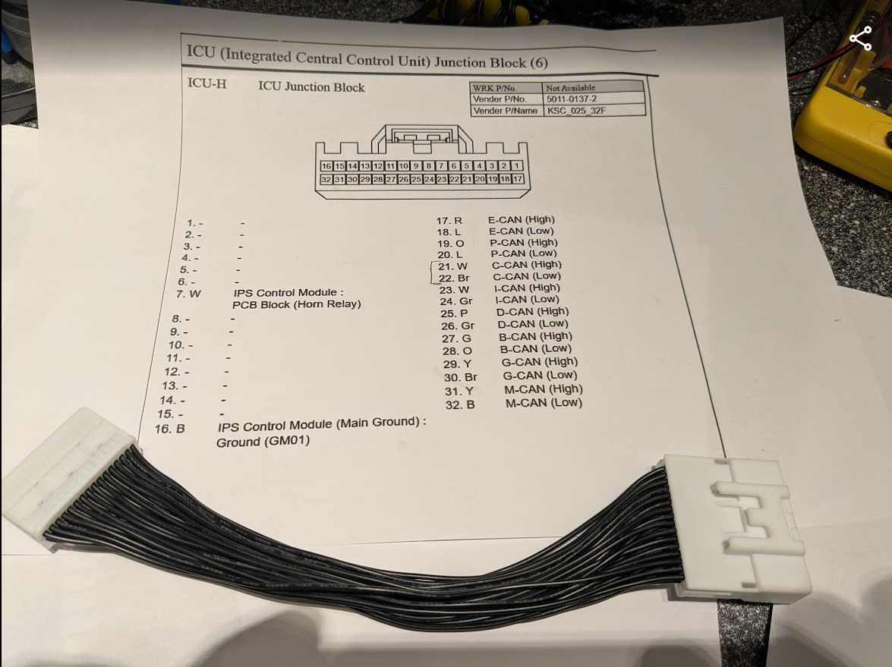

Harness with T-taps for all canbuses listed in the ICU-H schematics:
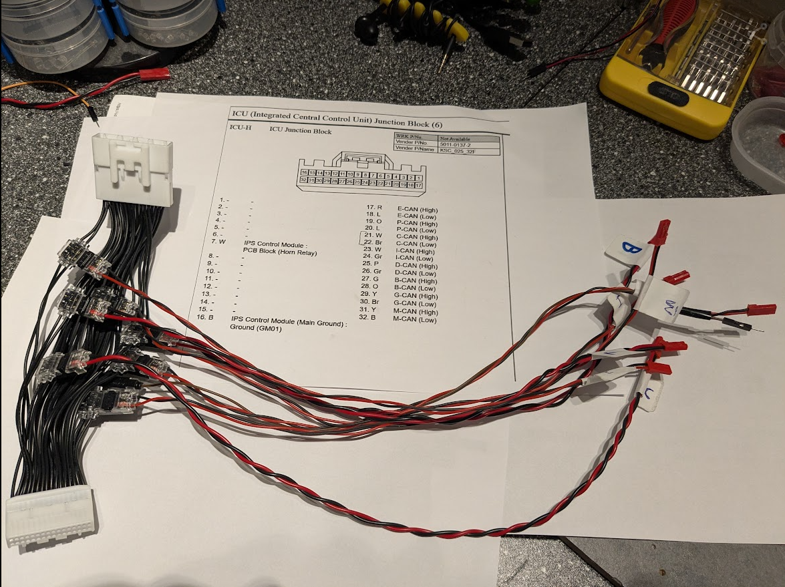
Remember to also tap into ground on connector 16 to get good quality signals. It is also recommended to use connectors that only fits one way on the tap ends so one do not swap can high and can low. 

The full setup from laptop to harness:
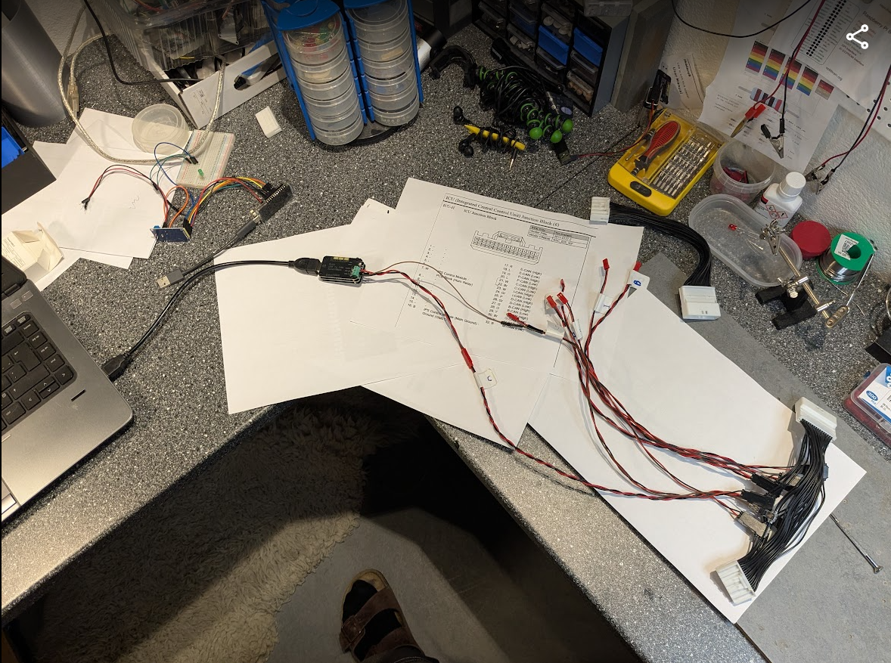

In car:
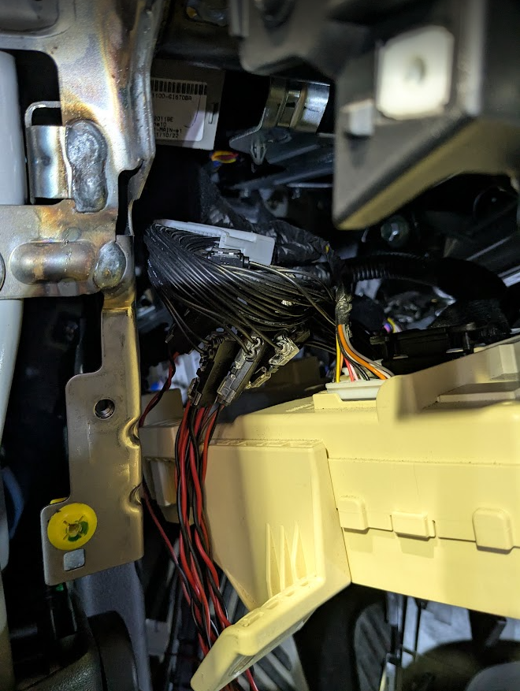
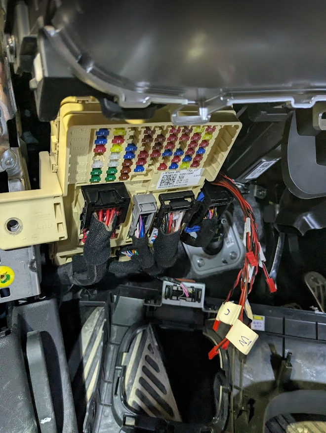
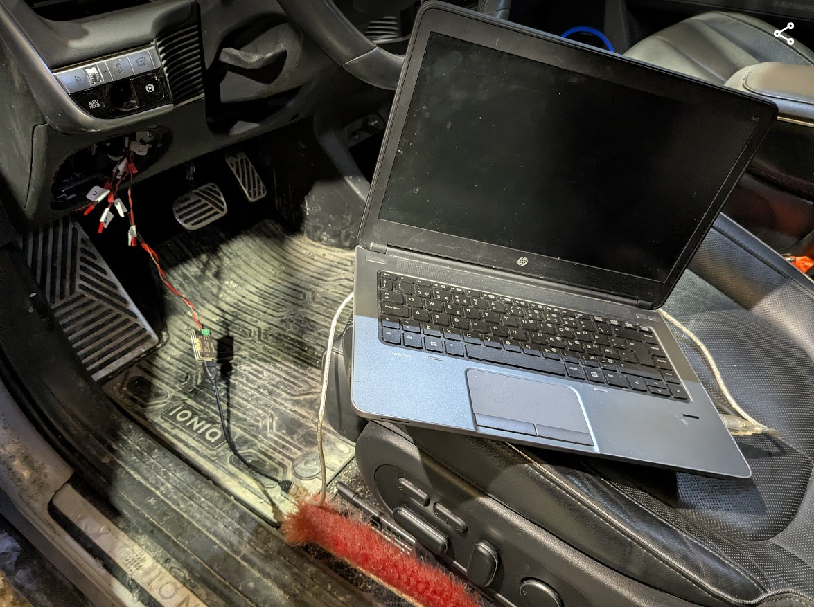

## Closing remarks.

### Fitting the connectors

The connector, ICU-H, is on the back side of the ICU and the easiest way to ensure that the harness with the modified plugs fits well is to entirely dismount the ICU and test the connectors.
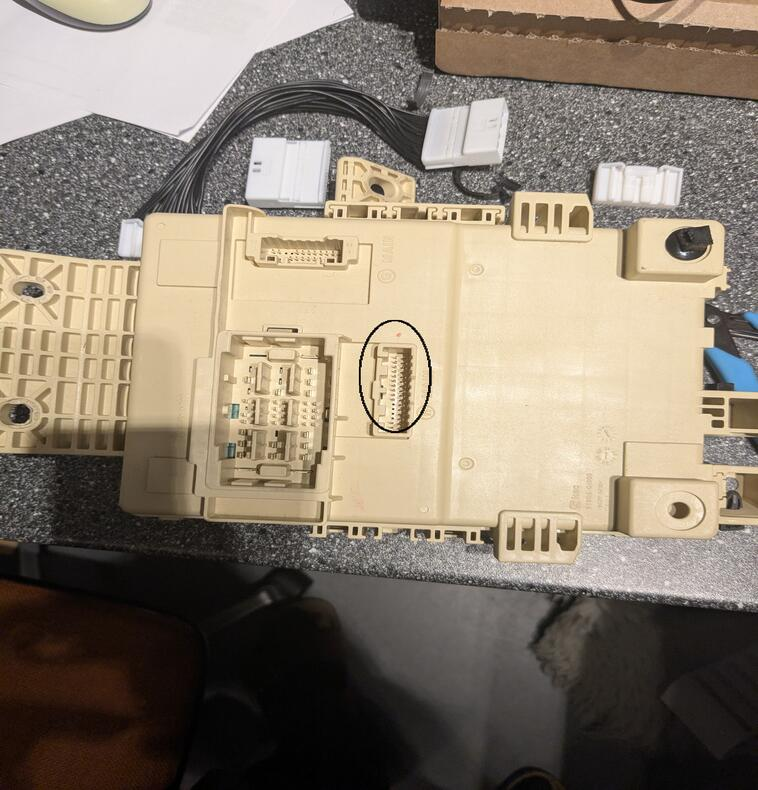

